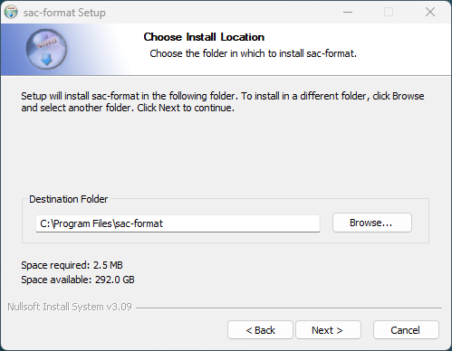
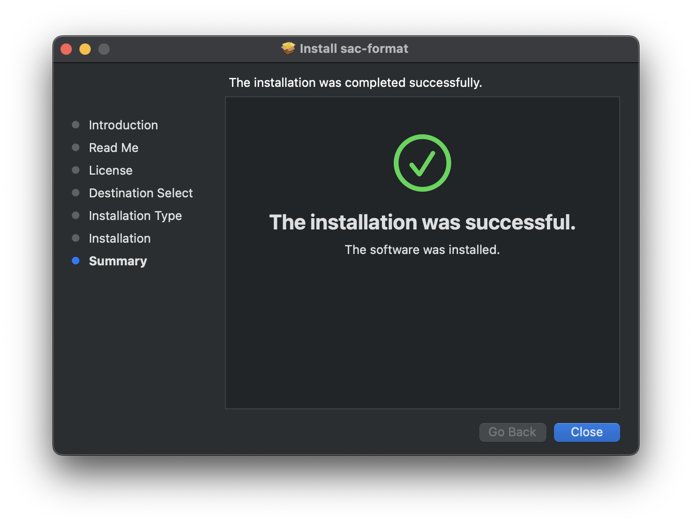

# Introduction

\mainpage

sac-format is a single-header statically linked library designed to make working
with binary
[SAC](https://ds.iris.edu/files/sac-manual/manual/file_format.html)-files as
easy as possible. Written in C++20, it follows a modern and easy to read
programming-style while providing the high performance brought by C++.

sac-format&rsquo;s developed on
[GitHub](https://github.com/arbCoding/sac-format)!

Download [sac-format](https://github.com/arbCoding/sac-format/releases) from the
GitHub release page.

[Download](https://arbcoding.github.io/sac-format/pdf/sac-format_manual.pdf) an
offline version of the documentation (PDF).

Get [help](https://github.com/arbCoding/sac-format/discussions/) from the
community forum.

## Why sac-format

sac-format is Free and Open Source Software (FOSS) released under the MIT
license. Anyone can use it, for any purpose (including proprietary software),
anywhere in the world. sac-format is operating system agnostic and confirmed
working on Windows, macOS, and Linux systems.

### Safe

sac-format is **safe** it conforms to a strict set of C++ programming
guidelines, chosen to ensure safe code-execution. The guideline conformance list
is in
[`cpp-linter.yml`](https://github.com/arbCoding/sac-format/blob/main/.github/workflows/cpp-linter.yml)
and can be cross-referenced against this [master
list](https://clang.llvm.org/extra/clang-tidy/checks/list.html). Results of
conformance checking are
[here](https://github.com/arbCoding/sac-format/actions/workflows/cpp-linter.yml).

Testing is an important part of software development; the sac-format library is
extensively tested using the [Catch2](https://github.com/catchorg/Catch2)
testing framework. Everything from low-level binary conversions to high-level
`Trace` reading/writing are tested and confirmed working. Check and run the
tests yourself. See the [Testing](#Testing) section for more information.

### Fast

sac-format is **fast** it's written in C++, carefully optimized,
and extensively benchmarked. You can run the benchmarks yourself to find out how
sac-format performs on your system. See the [Benchmarking](#Benchmarking)
section for more information.

### Easy

sac-format is **easy** single-header makes integration in any project
simple. Installation is easy with our automatic installers. Building is a breeze
with [CMake](https://cmake.org/), even on different platforms. Object-oriented
design makes use easy and intuitive. See the [Quickstart](#Quickstart) section
to get up and running.

### Small

sac-format is **small** in total (header +
implementation; excluding comments) the library is under 2100&lowast;
lines of code. Small size opens the door to using on any sort of hardware (old
or new) and makes it easy to expand upon.

&lowast; This value includes only the library, excluding all
testing/benchmarking and example codes. Including `utests.cpp`, `benchmark.cpp`,
`util.hpp`, the example program (`list_sac`), and sac-format totals just over
5100 lines of code.

### Documented

sac-format is extensively **documented** both online and in the code.
Nothing's hidden, nothing's obscured. Curious how something
works? Check the documentation and in-code comments.

### Transparent

sac-format is **transparent** all analysis and coverage information is
publicly available online.

-   [CodeFactor](https://www.codefactor.io/repository/github/arbcoding/sac-format)
-   [Codacy](https://app.codacy.com/gh/arbCoding/sac-format/dashboard)
-   [CodeCov](https://app.codecov.io/gh/arbCoding/sac-format)
-   [Coverity Scan](https://scan.coverity.com/projects/arbcoding-sac-format)

### Trace Class

sac-format includes the `Trace` class for seismic traces, providing high-level
object-oriented abstraction to seismic data. With the `Trace` class, you
don't need to worry about manually reading SAC-files word-by-word.
It's compatible with `v6` and `v7` SAC-files and can automatically detect
the version upon reading. File output defaults to `v7` SAC-files and there is a
`legacy_write` function for `v6` output.

### Low-Level I/O

If you want to roll your own SAC-file processing workflow you can use the
low-level I/O functionality built into sac-format. All functions tested and
confirmed working they're used to build the `Trace` class!

# Quickstart

## Installation

The easiest way to use sac-format is to install it via the automatic installers.
Installers for the latest release are located
[here](https://github.com/arbCoding/sac-format/releases/latest). Be sure to
check the sha512 checksum of the installer against its correspondingly named
`.sha512` file to ensure the file is safe (for example: `sac-format.pkg`
corresponds to `sac-format.pkg.sha512`).

### Windows

sac-format provides a graphical installer on Windows (`sac-format.exe`).

Always check the sha512 checksum value of the installer (`sac-format.exe`; [more
info
here](https://learn.microsoft.com/en-us/powershell/module/microsoft.powershell.utility/get-filehash?view=powershell-7.4))
against `sac-format.exe.sha512`.

By default, Microsoft Defender will block the installer with a pop-up like that
one below:


To continue the install, click on the &rsquo;More Info&rsquo; link and then the
&rsquo;Run anyway&rsquo; button as seen in the following image:


Then the installer will open and present you with the welcome screen:


By default, sac-format installs in `C:/Program Files/sac-format` as seen in the
screen below:



Because all programs in sac-format are command-line based feel free to disable
Start Menu shortcuts:


Upon successful install of sac-format you will see this window:


### macOS

sac-format provides both command line and graphical installers on macOS.

1.  Graphical

    The graphical installer is `sac-format.pkg` and will walk you through the
    installation process. **NOTE**: the default installation location is
    `/opt/sac-format`.
    
    By default, macOS will block the installer. To install, right-click on
    `sac-format.pkg` and select open. A warning will pop up that looks like:
    
    
    
    Simply click &rsquo;Open&rsquo; and the installer will begin from the first
    screen:
    
    
    
    Upon successfull installation you will see:
    
    

2.  Command line

    Command line installation is performed either using the self-extrating
    archive or by manually extracting the gzipped tar archive.
    
    1.  Self-Extracting Archive
    
        ```sh
        # Check the sha512 checksum
        sha512sum -c sac-format-<version>-Darwin-<arch>.sh.sha512
        # Run self-extracting archive
        bash sac-format-<version>-Darwin-<arch>.sh
        ```
        
        Be sure to replace `<version>` and `<arch>` with the correct versions
        and architectures, respectively (for example:
        `sac-format-0.4.0-Darwin-x86_64.sh`).
    
    2.  Gzipped Tar Archive
    
        ```bash
        # Check the sha512 checksum
        sha512sum -c sac-format-<version>-Darwin-<arch>.tar.gz.sha512
        # Extract Gzipped tar archive
        tar -xzf sac-format-<version>-Darwin-<arch>.tar.gz
        ```

### Linux

sac-format provides four different command line installation methods on Linux.

[Debian](https://www.debian.org/) based distributions (for example: Debian,
Ubuntu, Linux Mint) can use the Debian Archive.

[RedHat](https://www.redhat.com/) based distributions (for example: RedHat,
Fedora, CentOS) can use the RPM Archive.

All distributions can use the Self-Extracting Archive.

All distributions can use the Gzipped Tar Archive.

1.  Debian Archive

    ```bash
    # Check the sha512 checksum
    sha512sum -c sac-format.deb.sha512
    # Install using apt
    sudo apt install ./sac-format.deb
    ```

2.  RPM Archive

    ```bash
    # Check the sha512 checksum
    sha512sum -c sac-format.rpm.sha512
    # Install using rpm
    sudo rpm -i sac-format.rpm
    ```

3.  Self-Extrating Archive

    ```bash
    # Check the sha512 checksum
    sha512sum -c sac-format-<version>-Linux-<arch>.sh.sha512
    # Run self-extrating archive
    bash sac-format-<version>-Linux-<arch>.sh
    ```

4.  Gzipped Tar Archive

    ```bash
    # Check the sha512 checksum
    sha512sum -c sac-format-<version>-Linux-<arch>.tar.gz.sha512
    # Extract gzipped tar archive
    tar -xzf sac-format-<version>-Linux-<arch>.tar.gz
    ```

## Build Instructions

Building is as easy as cloning the repository, running CMake for your preferred
build tool, and then building.

### GCC

```bash
git clone https://github.com/arbCoding/sac-format.git
cmake --preset gcc-hard-release
cmake --build ./build/release/gcc
```

### Clang

```bash
git clone https://github.com/arbCoding/sac-format.git
cmake --preset clang-hard-release
cmake --build ./build/release/clang
```

## Use

To use link to the compiled library (`libsac-format.a` on Linux/macOS,
`sac-format.lib` on Windows) and include `sac_format.hpp`.

## Example Programs

### `list_sac`

`list_sac` is a command line program that takes a single SAC-file as its input
argument. It reads the SAC-file and outputs the header/footer information, as
well as the true size of the [`data1`](#%3Ddata1%3D) and [`data2`](#%3Ddata2%3D)
vectors.

## CMake Integration

To integrate sac-format into your CMake project, add it to your
`CMakeLists.txt`.

```cmake
include(FetchContent)
set(FETCHCONTENT_UPDATES_DISCONNECTED TRUE)
FetchContent_Declare(sac-format
    GIT_REPOSITORY https://github.com/arbCoding/sac-format
    GIT_TAG vX.X.X)
FetchContent_MakeAvailable(sac-format)
include_directory(${sacformat_SOURCE_DIR/src})

project (your_project
    LANGUAGES CXX)

add_executable(your_executable
    your_sources
    sac_format.hpp)

target_link_libraries_library(your_executable
    PRIVATE sac-format)
```

## Example

### Reading and Writing

```cpp
#include <sac_format.hpp>
#include <filesystem>
#include <iostream>

using namespace sacfmt;
namespace fs = std::filesystem;

int main() {
    Trace trace1{};
    // Change header variable
    trace1.kstnm("Station1");
    fs::path file{"./test.SAC"};
    // Write
    trace1.write(file);
    // Read
    Trace trace2 = Trace(file);
    // Confirm equality
    std::cout << (trace1 == trace2) << '\n';
    fs::remove(file);
    return EXIT_SUCCESS;
}
```

# Documentation

## Trace class

The `Trace` class provides easy access to SAC-files in C++. Each SAC-file is a
`Trace`; therefore, each `Trace` object is a seismic trace (seismogram).

### Reading SAC

SAC-files can be read in by using the parameterized constructor with a
[`std::filesystem::path`](https://en.cppreference.com/w/cpp/filesystem/path)
([`<filesystem>`](https://en.cppreference.com/w/cpp/header/filesystem)) or a
[`std::string`](https://en.cppreference.com/w/cpp/string/basic_string)
([`<string>`](https://en.cppreference.com/w/cpp/header/string)) variable that
corresponds to the location of the SAC-file.

For example:

```cpp
#include <sac_foramt.hpp>
#include <filesystem>

int main() {
  std::filesystem::path my_file{"/home/user/data/ANMO.SAC"};
  sacfmt::Trace anmo = sacfmt::Trace(my_file);
  return EXIT_SUCCESS;
}
```


### Writing SAC

Writing SAC files can be done using one of two write functions.

1.  `v7` files

    Use `write` (for example `trace.write(filename)`).

2.  `v6` files

    Use `legacy_write` (for example `trace.legacy_write(filename)`).

### Getters and Setters

Every [SAC variable](#SAC-file%20format) is accessed via getters and setters of
the same name.

1.  Example Getters

    -   `trace.npts()`
    -   `trace.data1()`
    -   `trace.kstnm()`

2.  Example Setters

    -   `trace.kevnm("Event 1")`
    -   `trace.evla(32.89)`
    -   `trace.mag(3.21)`

3.  Setter rules

    Most of the setters are only constrained by the parameter type
    (single-precision, double-precision, boolean, etc.). **Some** setters are
    constrained by additional rules.
    
    1.  Required for sanity
    
        Rules here are required because the sac-format library assumes them (not
        strictly required by the SAC format standard). For instance, the
        geometric functions assume certain bounds on latitudes and longitudes.
        sac-format automatically imposes these rules.
        
        1.  `stla(input)`
        
            Limited to $[-90, 90]$ degrees, input that is outside that range is
            reduced using circular symmetry.
        
        2.  `stlo(input)`
        
            Limited to $[-180, 180]$ degrees, input that is outside that range
            is reduced using circular symmetry.
        
        3.  `evla(input)`
        
            Limited to $[-90, 90]$ degrees, input that is outside that range is
            reduced using circular symmetry.
        
        4.  `evlo(input)`
        
            Limited to $[-180, 180]$ degrees, input that is outside that range
            is reduced using circular symmetry.
    
    2.  Required for safety
    
        Rules here are required by the SAC format standard. sac-format
        automatically imposes these rules to prevent the creation of corrupt
        sac-files.
        
        1.  `npts(input)`
        
            Because `npts` defines the size of the data vectors, changing this
            value will change the size of `data1` and `data2`&lowast;.
            Increasing npts resizes the vectors
            ([std::vector::resize](https://en.cppreference.com/w/cpp/container/vector/resize))
            by placing zeros at the **end** of the vectors. Reducing npts
            resizes the vectors down to the **first npts** values.
            
            Therefore, care must be taken to maintain separate copies of `data1`
            and `data2`&lowast; if you plan to manipulate the original data
            **after** resizing.
            
            &lowast; data2 has `npts` only if it is legal, otherwise it is of
            size 0.
        
        2.  `leven(input)`
        
            Changing the value of `leven` potentially changes the legality of
            `data2`, it also potentially affects the value of `iftype`.
            
            If iftype$>1$, then leven must be `true` (evenly sampled data).
            Therefore, if leven is made `false` in this scenario (unevenly
            sampled data) then iftype becomes unset&lowast;.
            
            If changing leven makes data2 legal&lowast;&lowast;, then data2 is
            resized to have `npts` zeros.
            
            &lowast; The SAC format defines the unset values for all data-types.
            For integers (like iftype) it is the integer value `-12345`.
            
            &lowast;&lowast; If data2 was already legal, then it is unaffected.
        
        3.  `iftype(input)`
        
            Changing the value of `iftype` poentially changes the legality of
            `data2`, it also potentially affects the value of `leven`.
            
            If leven is `false`, then iftype must be either 1 or unset.
            Therefore, changing iftype to have a value $>1$ requires that leven
            becomes `true` (evenly sampled data).
            
            If changing iftype makes data2 legal&lowast;, then data2 is resized
            to have `npts` zeros.
            
            &lowast; If data2 was already legal, then it is unaffected.
        
        4.  `data1(input)`
        
            If the size of `data1` is changed, then `npts` must change to
            reflect the new size. If `data2` is legal, this adjusts its size to
            match as well.
        
        5.  `data2(input)`
        
            If the size of `data2` is changed to be larger than 0 and it is
            illegal, it is made legal by setting `iftype(2)` (spectral-data).
            
            When the size of data2 changes, `npts` is updated to the new size
            and `data1` is resized to match.
            
            If `data2` is made illegal, its size is reduced to 0 while `npts`
            and `data1` are unaffected.

### Internal Structure

The SAC-trace stores the data internally in a series of pre-allocated
[`std::array`](https://en.cppreference.com/w/cpp/container/array)
([`<array>`](https://en.cppreference.com/w/cpp/header/array)) container objects.
[Getters and setters](#Getters%20and%20Setters) access these via a [lookup
table](#Lookup%20Table). The internal components are below:

1.  Lookup Table

    `sac_map`

2.  `floats` array

3.  `doubles` array

4.  `ints` array

5.  `bools` array

6.  `strings` array

7.  `data` array

### Convenience Methods

-   `calc_geometry`

Calculate `gcarc`, `dist`, `az`, and `baz` assuming spherical Earth.

```cpp
trace.stla(45.3);
trace.stlo(34.5);
trace.evla(18.5);
trace.evlo(-34);
trace.calc_geometry();
std::cout << "GcArc: " << trace.gcarc() << '\n';
std::cout << "Dist: " << trace.dist() << '\n';
std::cout << "Azimuth: " << trace.az() << '\n';
std::cout << "BAzimuth: " << trace.baz() << '\n';
```

-   `frequency`

Calculate frequency from `delta`.

```cpp
double frequency{trace.frequency()};
```

-   `date`

Return `std::string` formatted as `YYYY-JJJ` from `nzyear` and `nzjday`.

```cpp
std::string date{trace.date()};
```

-   `time`

Return `std::string` formatted as `HH:MM:SS.xxx` from `nzhour`, `nzmin`, `nzsec`, and `nzmsec`.

```cpp
std::string time{trace.time()};
```

### Exceptions

sac-format throws exceptions of type `sacfmt::io_error` (inherits
[`std::exception`](https://en.cppreference.com/w/cpp/error/exception)) in the
event of a failure to read/write a SAC-file.

## Convenience Functions

-   `degrees_to_radians`

Convert decimal degrees to radians.

```cpp
double radians{sacfmt::degrees_to_radians(degrees)};
```

-   `radians_to_degrees`

Convert radians to decimal degrees.

```cpp
double degrees{sacfmt::radians_to_degrees(radians)};
```

-   `gcarc`

Calculate great-circle arc distance (spherical planet).

```cpp
double gcarc{sacfmt::gcarc(latitude1, longitude1, latitude2, longitude2)};
```

-   `azimuth`

Calculate azimuth between two points (spherical planet).

```cpp
double azimuth{sacfmt::azimuth(latitude2, longitude2, latitude1, longitude1)};
double back_azimuth{sacfmt::azimuth(latitude1, longitude1, latitude2, longitude2)};
```

-   `limit_360`

Take arbitrary value of degrees and unwrap to $[0, 360]$.

```cpp
double degrees_limited{sacfmt::limit_360(degrees)};
```

-   `limit_180`

Take arbitrary value of degrees and unwrap to $[-180, 180]$. Useful for
longitude.

```cpp
double degrees_limited{sacfmt::limit_180(degrees)};
```

-   `limit_90`

Take arbitrary value of degrees and unwrap to $[-90, 90]$. Useful for latitude.

```cpp
double degrees_limited{sacfmt::limit_90(degrees)};
```


## Low-Level I/O

Low-level I/O functions are discussed below.

1.  Binary conversion

    1.  `int_to_binary` and `binary_to_int`
    
        Conversion pair for binary representation of integer values.
        
        ```cpp
        const int input{10};
        // sacfmt::word_one is alias for std::bitset<32> (one word)
        sacfmt::word_one binary{sacfmt::int_to_binary(input)};
        const int output{sacfmt::binary_to_int(binary)};
        std::cout << (input == output) << '\n';
        ```
    
    2.  `float_to_binary` and `binary_to_float`
    
        Conversion pair for binary representation of floating-point values.
        
        ```cpp
        const float input{5F};
        sacfmt::word_one binary{sacfmt::float_to_binary(input)};
        const float output{sacfmt::binary_to_float(binary)};
        std::cout << (input == output) << '\n';
        ```
    
    3.  `double_to_binary` and `binary_to_double`
    
        Conversion pair for binary representation of double-precision values.
        
        ```cpp
        const double input{1e5};
        // sacfmt::word_two is alias for std::bitset<64> (two words)
        sacfmt::word_two binary{sacfmt::double_to_binary(input)};
        const double output{sacfmt::binary_to_double(binary)};
        std::cout << (input == output) << '\n';
        ```
    
    4.  `string_to_binary` and `binary_to_string`
    
        Conversion pair for binary representation of two-word (regular) string
        values.
        
        ```cpp
        const std::string input{"NmlStrng"};
        sacfmt::word_two binary{sacfmt::string_to_binary(input)};
        const std::string output{sacfmt::binary_to_string(binary)};
        std::cout << (input == output) << '\n';
        ```
    
    5.  `long_string_to_binary` and `binary_to_long_string`
    
        Conversion pair for binary representation of four-word (only
        [`kstnm`](#%3Dkstnm%3D)) string values.
        
        ```cpp
        const std::string input{"The Long String"};
        // sacfmt::word_four is alias for std::bitset<128> (four words)
        sacfmt::word_four binary{sacfmt::long_string_to_binary(input)};
        const std::string output{sacfmt::binary_to_long_string(binary)};
        std::cout << (input == output) << '\n';
        ```

2.  Reading/Writing

    **NOTE** that care must be taken when using them to ensure that safe input
    is provided; the `Trace` class ensures safe I/O, low-level I/O functions do
    not necessarily ensure safety.
    
    1.  `read_word`, `read_two_words`, `read_four_words`, and `read_data`
    
        Functions to read one-, two-, and four-word variables (depending on the
        header) and an arbitrary amount of binary data (exclusive to `data1` and
        `data2`).
    
    2.  `convert_to_word`, `convert_to_words`, and `bool_to_word`
    
        Takes objects and converts them into `std::vector<char>`
        (`convert_to_word` and `bool_to_word`) or `std::array<char, N>`
        (`convert_to_words`, N = # of words).
    
    3.  `write_words`
    
        Writes input words (as `std::vector<char>`) to a binary SAC-file.

3.  Utility

    1.  `concat_words`
    
        Concatenates words taking into account the system endianness.
    
    2.  `bits_string` and `string_bits`
    
        Template function that performs conversion of binary strings of
        arbitrary length to an arbitrary number of words.
    
    3.  `remove_leading_spaces` and `remove_trailing_spaces`
    
        Remove leading and trailing blank spaces from strings assuming ASCII
        convention (space character is integer 32, below that value are control
        characters that also appear as blank spaces).
    
    4.  `string_cleaning`
    
        Ensures string does not contain an internal termination character (`\0`)
        and removes it if present, then removes blank spaces.
    
    5.  `prep_string`
    
        Performs `string_cleaning` followed by string truncation/padding to the
        necessary length.
    
    6.  `equal_within_tolerance`
    
        Floating-point/double-precision equality within a provided tolerance
        (default is `f_eps`, defined in `sac_format.hpp`).


<a id="Testing"></a>

## Testing

`utests.cpp` contains the unit- and integration-tests, using Catch2. Test
coverage details are visible on
[CodeCov.io](https://app.codecov.io/gh/arbCoding/sac-format) and
[Codacy.com](https://app.codacy.com/gh/arbCoding/sac-format/dashboard). All
tests can be locally-run to ensure full functionality and compliance.

### Errors only

By default `utests` prints out a pass summary, without details unless an error
is encountered.

### Full output

By passing the `--success` flag (`utests --success`) you can see the full
results of all tests.

### Compact output

The [full output](#Full%20output) is verbose, using the compact reporter will
condense the test results (`utests --reporter=compact --success`).

### Additional options

To see additional options, run `utests -?`.

### Using ctest

If you have CMake install, you can run the tests using `ctest`.

## Benchmarking

`benchmark.cpp` contains the benchmarks. Running it locally will provide
information on how long each function takes; benchmarks start with the low-level
I/O function and build up to Trace reading, writing, and equality comparison.

To view available optional flags, run `becnhmark -?`.

## Source File List

### Core

The two core files are split in the standard interface (hpp)/implementation
(cpp) format.

1.  `sac_format.hpp`

    Interface&#x2014;function declarations and constants.

2.  `sac_format.cpp`

    Implementation&#x2014;function details.

### Testing and Benchmarking

1.  `util.hpp`

    Utility functions and constants exclusive to testing and benchmarking. Not
    split into interface/implementation.

2.  `utests.cpp`

3.  `benchmark.cpp`

### Example programs

1.  `list_sac.cpp`

## Dependencies

### Automatic (CMake)

1.  [Xoshiro-cpp v1.12.0](https://github.com/Reputeless/Xoshiro-cpp) (testing
    and benchmarking)
2.  [Catch2 v3.4.0](https://github.com/catchorg/Catch2) (testing and
    benchmarking)

## SAC-file format

The official and up-to-date documentation for the SAC-file format is available
from the EarthScope Consortium (formerly IRIS/UNAVCO)
[here](https://ds.iris.edu/files/sac-manual/manual/file_format.html). The
following subsections constitute my notes on the format. Below is a quick
guide&#x2014;all credit for the creation of, and documentation for, the SAC
file-format belongs to its developers and maintainers (details
[here](https://ds.iris.edu/ds/nodes/dmc/software/downloads/sac/)).

### Floating-point (39)

32-bit (1 word, 4 bytes)

1.  `depmin`

    Minimum value of the dependent variable
    (displacement/velocity/acceleration/volts/counts).

2.  `depmen`

    Mean value of the dependent variable.

3.  `depmax`

    Maximum value of the dependent variable.

4.  `odelta`

    Modified (*observational*) value of [`delta`](#%3Ddelta%3D).

5.  `resp(0--9)`

    Instrument response parameters (poles, zeros, and a constant).
    
    **Not used by SAC**&#x2014;they&rsquo;re free for other purposes.

6.  `stel`

    Station elevation in meters above sea level (*m.a.s.l*).
    
    **Not used by SAC**&#x2014;free for other purposes.

7.  `stdp`

    Station depth in meters below surface (borehole/buried vault).
    
    **Not used by SAC**&#x2014;free for other purposes.

8.  `evel`

    Event elevation *m.a.s.l.*
    
    **Not used by SAC**&#x2014;free for other purposes.

9.  `evdp`

    Event depth in kilometers (*previously meters*) below surface.

10. `mag`

    Event magnitude.

11. `user(0--9)`

    Storage for user-defined values.

12. `dist`

    Station&#x2013;Event distance in kilometers.

13. `az`

    Azimuth $\mathrm{\left(Event \to Station\right)}$, decimal degrees from
    North.

14. `baz`

    Back-azimuth $\mathrm{\left(Station \to Event\right)}$, decimal degrees from
    North.

15. `gcarc`

    Station&#x2013;Event great circle arc-length, decimal degrees.

16. `cmpaz`

    Instrument measurement azimuth, decimal degrees from North.
    
    | Value    | Direction |
    -----------|------------
    | 0&deg;   | North     |
    | 90&deg;  | East      |
    | 180&deg; | South     |
    | 270&deg; | West      |
    | Other    | 1/2/3     |

17. `cmpinc`

    Instrument measurement incident angle, decimal degrees from upward vertical
    (incident 0&deg; = dip -90&deg;).
    
    | Value    | Direction  |
    | 0&deg;   | Up         |
    | 90&deg;  | Horizontal |
    | 180&deg; | Down       |
    | 270&deg; | Horizontal |
    
    **NOTE:** SEED/MINISEED use dip angle, decimal degrees down from horizontal
    (dip 0&deg; = incident 90&deg;).

18. `xminimum`

    Spectral-only equivalent of [`depmin`](#%3Ddepmin%3D) ($f_{0}$ or
    $\omega_{0}$).

19. `xmaximum`

    Spectral-only equivalent of [`depmax`](#%3Ddepmax%3D) ($f_{max}$ or
    $\omega_{max}$).

20. `yminimum`

    Spectral-only equivalent of [`b`](#%3Db%3D).

21. `ymaximum`

    Spectral-only equivalent of [`e`](#%3De%3D).

### Double (22)

64-bit (2 words, 8 bytes)

**NOTE:** in the header section these are floats&#x2014;they&rsquo;re doubles in
the footer section of `v7` SAC-files. In memory they&rsquo;re stored as doubles
regardless of the SAC-file version.

1.  `delta`

    Increment between evenly spaced samples ($\Delta t$ for timeseries, $\Delta
    f$ or $\Delta\omega$ for spectra).

2.  `b`

    First value (*begin*) of independent variable ($t_{0}$).

3.  `e`

    Final value (*end*) of independent variable ($t_{max}$).

4.  `o`

    Event *origin* time, in seconds relative to the reference time.

5.  `a`

    Event first *arrival* time, in seconds relative to the reference time.

6.  `t(0--9)`

    User defined *time* values, in seconds relative to the reference time.

7.  `f`

    Event end (*fini*) time, in seconds relative to the reference time.

8.  `stla`

    Station latitude in decimal degrees, N/S&#x2013;positive/negative.
    
    sac-format automatically enforces $\mathrm{stla}\in[-90, 90]$.

9.  `stlo`

    Station longitude in decimal degrees, E/W&#x2013;positive/negative.
    
    sac-format automatically enforces $\mathrm{stlo}\in[-180, 180]$.

10. `evla`

    Event latitude in decimal degrees, N/S&#x2013;positive/negative.
    
    sac-format automatically enforces $\mathrm{evla}\in[-90, 90]$.

11. `evlo`

    Event longitude in decimal degrees, E/W&#x2013;positive/negative.
    
    sac-format automatically enforces $\mathrm{evlo}\in[-180, 180]$.

12. `sb`

    Original (*saved*) [`b`](#%3Db%3D) value.

13. `sdelta`

    Original (*saved*) [`delta`](#%3Ddelta%3D) value.

### Integer (26)

32-bit (1 word, 4 bytes)

1.  `nzyear`

    Reference time GMT year.

2.  `nzjday`

    Reference time GMT day-of-year (often called [Julian
    Date](https://en.wikipedia.org/wiki/Julian_day)) (1&#x2013;366).

3.  `nzhour`

    Reference time GMT hour (00&#x2013;23).

4.  `nzmin`

    Reference time GMT minute (0&#x2013;59).

5.  `nzsec`

    Reference time GMT second (0&#x2013;59).

6.  `nzmsec`

    Reference time GMT Millisecond (0&#x2013;999).

7.  `nvhdr`

    SAC-file version.
    
    | Version | Description                       |
    | `v7`    | Footer (2020+, sac 102.0+)        |
    | `v6`    | No footer (pre-2020, sac 101.6a-) |

8.  `norid`

    Origin ID.

9.  `nevid`

    Event ID.

10. `npts`

    *Number of points* in data.

11. `nsnpts`

    Original (*saved*) [`npts`](#%3Dnpts%3D).

12. `nwfid`

    Waveform ID.

13. `nxsize`

    Spectral-only equivalent of [`npts`](#%3Dnpts%3D) (length of spectrum).

14. `nysize`

    Spectral-only, width of spectrum.

15. `iftype`

    File type.
    
    | Value | Type         | Description                |
    | 01    | ITIME        | Time-series                |
    | 02    | IRLIM        | Spectral (real/imaginary)  |
    | 03    | IAMPH        | Spectral (amplitude/phase) |
    | 04    | IXY          | General XY file            |
    | ??    | IXYZ&lowast; | General XYZ file           |
    
    &lowast;Value not listed in the standard.

16. `idep`

    Dependent variable type.
    
    | Value | Type   | Description                                           |
    | 05    | IUNKN  | Unknown                                               |
    | 06    | IDISP  | Displacement (nm)                                     |
    | 07    | IVEL   | Velocity $\mathrm{\left(\frac{nm}{s}\right)}$         |
    | 08    | IACC   | Acceleration $\mathrm{\left(\frac{nm}{s^{2}}\right)}$ |
    | 50    | IVOLTS | Velocity (volts)                                      |

17. `iztype`

    Reference time equivalent.
    
    | Value        | Type           | Description                |
    | 05           | IUNKN          | Unknown                    |
    | 09           | IB             | Recording start time       |
    | 10           | IDAY           | Midnight reference GMT day |
    | 11           | IO             | Event origin time          |
    | 12           | IA             | First arrival time         |
    | 13&#x2013;22 | IT(0&#x2013;9) | User defined time (t) pick |

18. `iinst`

    Recording instrument type.
    
    **Not used by SAC**&#x2014;free for other purposes.

19. `istreg`

    Station geographic region.
    
    **Not used by SAC**&#x2014;free for other purposes.

20. `ievreg`

    Event geographic region.
    
    **Not used by SAC**&#x2014;free for other purposes.

21. `ievtyp`

    Event type.
    
    | Value | Type   | Description                                               |
    | 05    | IUNKN  | Unknown                                                   |
    | 11    | IO     | Other source of known origin                              |
    | 37    | INUCL  | Nuclear                                                   |
    | 38    | IPREN  | Nuclear pre-shot                                          |
    | 39    | IPOSTN | Nuclear post-shot                                         |
    | 40    | IQUAKE | Earthquake                                                |
    | 41    | IPREQ  | Foreshock                                                 |
    | 42    | IPOSTQ | Aftershock                                                |
    | 43    | ICHEM  | Chemical explosion                                        |
    | 44    | IOTHER | Other                                                     |
    | 72    | IQB    | Quarry/mine blast&#x2014;confirmed by quarry/mine         |
    | 73    | IQB1   | Quarry/mine blast&#x2014;designed shot info-ripple fired  |
    | 74    | IQB2   | Quarry/mine blast&#x2014;observed shot info-ripple fired  |
    | 75    | IQBX   | Quarry/mine blast&#x2014;single shot                      |
    | 76    | IQMT   | Quarry/mining induced events&#x2014;tremor and rockbursts |
    | 77    | IEQ    | Earthquake                                                |
    | 78    | IEQ1   | Earthquake in a swarm or in an aftershock sequence        |
    | 79    | IEQ2   | Felt earthquake                                           |
    | 80    | IME    | Marine explosion                                          |
    | 81    | IEX    | Other explosion                                           |
    | 82    | INU    | Nuclear explosion                                         |
    | 83    | INC    | Nuclear cavity collapse                                   |
    | 85    | IL     | Local event of unknown origin                             |
    | 86    | IR     | Region event of unknown origin                            |
    | 87    | IT     | Teleseismic event of unknown origin                       |
    | 88    | IU     | Undetermined/conflicting information                      |

22. `iqual`

    Quality of data.
    
    | Value | Type   | Description               |
    | 44    | IOTHER | Other                     |
    | 45    | IGOOD  | Good                      |
    | 46    | IGLCH  | Glitches                  |
    | 47    | IDROP  | Dropouts                  |
    | 48    | ILOWSN | Low signal-to-noise ratio |
    
    **Not used by SAC**&#x2014;free for other purposes.

23. `isynth`

    Synthetic data flag.
    
    | Value | Type     | Description |
    | 49    | IRLDATA  | Real data   |
    | XX    | &lowast; | Synthetic   |
    
    &lowast;Values and types not listed in the standard.

24. `imagtyp`

    Magnitude type.
    
    | Value | Type | Description                      |
    | 52    | IMB  | Body-wave magnitude ($M_{b}$)    |
    | 53    | IMS  | Surface-wave magnitude ($M_{s}$) |
    | 54    | IML  | Local magnitude ($M_{l}$)        |
    | 55    | IMW  | Moment magnitude ($M_{w}$)       |
    | 56    | IMD  | Duration magnitude ($M_{d}$)     |
    | 57    | IMX  | User-defined magnitude ($M_{x}$) |

25. `imagsrc`

    Source of magnitude information.
    
    | Value | Type     | Description                            |
    | 58    | INEIC    | National Earthquake Information Center |
    | 61    | IPDE     | Preliminary Determination of Epicenter |
    | 62    | IISC     | Internation Seismological Centre       |
    | 63    | IREB     | Reviewed Event Bulletin                |
    | 64    | IUSGS    | U.S. Geological Survey                 |
    | 65    | IBRK     | UC Berkeley                            |
    | 66    | ICALTECH | California Institute of Technology     |
    | 67    | ILLNL    | Lawrence Livermore National Laboratory |
    | 68    | IEVLOC   | Event location (computer program)      |
    | 69    | IJSOP    | Joint Seismic Observation Program      |
    | 70    | IUSER    | The user                               |
    | 71    | IUNKNOWN | Unknown                                |

26. `ibody`

    Body/spheroid definition used to calculate distances.
    
    | Value  | Type     | Name               | Semi-major axis (a [m]) | Inverse Flattening (*f*) |
    | -12345 | UNDEF    | Earth (*Historic*) | 6378160.0               | 0.00335293               |
    | 98     | ISUN     | Sun                | 696000000.0             | 8.189e-6                 |
    | 99     | IMERCURY | Mercury            | 2439700.0               | 0.0                      |
    | 100    | IVENUS   | Venus              | 6051800.0               | 0.0                      |
    | 101    | IEARTH   | Earth (*WGS84*)    | 6378137.0               | 0.0033528106647474805    |
    | 102    | IMOON    | Moon               | 1737400.0               | 0.0                      |
    | 103    | IMARS    | Mars               | 3396190.0               | 0.005886007555525457     |

### Boolean (4)

32-bit (1 word, 4 bytes) in-file/8-bit (1 byte) in-memory

1.  `leven`

    **REQUIRED**
    
    Evenly-spaced data flag.
    
    If true, then data is evenly spaced.

2.  `lpspol`

    Station polarity flag.
    
    If true, then station has positive-polarity&#x2014;it follows the left-hand
    convention (for example, North-East-Up [NEZ]).

3.  `lovrok`

    File overwrite flag.
    
    If true, then it&rsquo;s okay to overwrite the file.

4.  `lcalda`

    Calculate geometry flag.
    
    If true, then calculate [`dist`](#%3Ddist%3D), [`az`](#%3Daz%3D),
    [`baz`](#%3Dbaz%3D), and [`gcarc`](#%3Dgcarc%3D) from [`stla`](#%3Dstla%3D),
    [`stlo`](#%3Dstlo%3D), [`evla`](#%3Devla%3D), and [`evlo`](#%3Devlo%3D).

### String (23)

32/64-bit (2/4 words, 8/16 bytes, 8/16 characters)

1.  `kstnm`

    Station name.

2.  `kevnm`&lowast;

    Event name.
    
    &lowast;This is the **only** four word (16 character) string.

3.  `khole`

    Nuclear&#x2014;hole identifier.
    
    Other&#x2014;Location identifier (LOCID).

4.  `ko`

    Text for [`o`](#%3Do%3D).

5.  `ka`

    Text for [`a`](#%3Da%3D).

6.  `kt(0--9)`

    Text for [`t(0--9)`](#%3Dt%280--9%29%3D).

7.  `kf`

    Text for [`f`](#%3Df%3D).

8.  `kuser(0--2)`

    Text for the first three of [`user(0--9)`](#%3Duser%280--9%29%3D).

9.  `kdatrd`

    Date the data was read onto a computer.

10. `kinst`

    Text for [`iinst`](#%3Diinst%3D).

### Data (2)

32-bit (2 words, 8 bytes) in-file/64-bit (4 words, 16 bytes) in-memory

Stored as floating-point (32-bit) values in SAC-files; stored as
double-precision in memory.

1.  `data1`

    The first data vector---**always** present in a SAC-file and begins at word
    158.

2.  `data2`

    The second data vector---**conditionally** present and begins after
    [`data1`](#%3Ddata1%3D).
    
    **Required** if [`leven`](#%3Dleven%3D) is false, or if
    [`iftype`](#%3Diftype%3D) is spectral/XY/XYZ.

# Notes

## Why C++20 and not C++23

Compiler restrictions&#x2014;C++23 support
[requires](https://en.cppreference.com/w/cpp/compiler_support/23) GCC-13+ and
Clang-16+. Many systems, still use GCC-12 and Clang-15&#x2014;which has near
complete support for
[C++20](https://en.cppreference.com/w/cpp/compiler_support/20).

sac-format strives for accessibility, modernity, safety, and speed&#x2014;C++20
provides the best fit.
