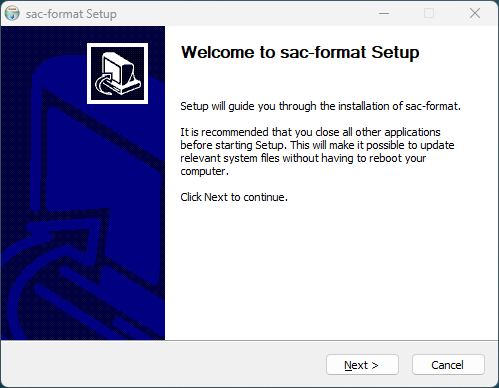

# Installation {#Install}

@brief This section provides installation instructions.

The easiest way to use sac-format is to install it via the automatic installers.
Installers for the latest release are located
[here](https://github.com/arbCoding/sac-format/releases/latest). Be sure to
check the sha512 checksum of the installer against its correspondingly named
`.sha512` file to ensure the file is safe (for example: `sac-format.pkg`
corresponds to `sac-format.pkg.sha512`).

## Windows

sac-format provides a graphical installer on Windows (`sac-format.exe`).

Always check the sha512 checksum value of the installer (`sac-format.exe`;
[more info here](https://learn.microsoft.com/en-us/powershell/module/microsoft.powershell.utility/get-filehash?view=powershell-7.4))
against `sac-format.exe.sha512`.

By default, Microsoft Defender will block the installer with a pop-up like that
one below:


To continue the install, click on the "More Info" link and then the "Run anyway"
button as seen in the following image:


Then the installer will open and present you with the welcome screen:



By default, sac-format installs in `C:/Program Files/sac-format` as seen in the
screen below:


Because all programs in sac-format are command-line based feel free to disable
Start Menu shortcuts:


Upon successful install of sac-format you will see this window:


## macOS

sac-format provides both command line and graphical installers on macOS.

### Graphical

The graphical installer is `sac-format.pkg` and will walk you through the
installation process. **NOTE**: the default installation location is
`/opt/sac-format`.
  
By default, macOS will block the installer. To install, right-click
on `sac-format.pkg` and select open. A warning will pop up that looks like:


Simply click "Open" and the installer will begin from the first screen:


Upon successful installation you will see:


### Command line

Command line installation is performed either using the self-extrating archive
or by manually extracting the gzipped tar archive.

#### Self-Extracting Archive

```bash
# Check the sha512 checksum
sha512sum -c sac-format-<version>-Darwin-<arch>.sh.sha512
# Run self-extracting archive
bash sac-format-<version>-Darwin-<arch>.sh
```

Be sure to replace `<version>` and `<arch>` with the correct versions and
architectures, respectively (for example: `sac-format-0.4.0-Darwin-x86_64.sh`).

#### Gzipped Tar Archive

```bash
# Check the sha512 checksum
sha512sum -c sac-format-<version>-Darwin-<arch>.tar.gz.sha512
# Extract Gzipped tar archive
tar -xzf sac-format-<version>-Darwin-<arch>.tar.gz
```

## Linux

sac-format provides four different command line installation methods on Linux.

[Debian](https://www.debian.org/) based distributions (for example: Debian,
Ubuntu, Linux Mint) can use the Debian Archive.

[RedHat](https://www.redhat.com/) based distributions (for example: RedHat,
Fedora, CentOS) can use the RPM Archive.

All distributions can use the Self-Extracting Archive.

All distributions can use the Gzipped Tar Archive.

### Debian Archive

```bash
# Check the sha512 checksum
sha512sum -c sac-format.deb.sha512
# Install using apt
sudo apt install ./sac-format.deb
```

### RPM Archive

```bash
# Check the sha512 checksum
sha512sum -c sac-format.rpm.sha512
# Install using rpm
sudo rpm -i sac-format.rpm
```

### Self-Extrating Archive

```bash
# Check the sha512 checksum
sha512sum -c sac-format-<version>-Linux-<arch>.sh.sha512
# Run self-extrating archive
bash sac-format-<version>-Linux-<arch>.sh
```

### Gzipped Tar Archive

```bash
# Check the sha512 checksum
sha512sum -c sac-format-<version>-Linux-<arch>.tar.gz.sha512
# Extract gzipped tar archive
tar -xzf sac-format-<version>-Linux-<arch>.tar.gz
```
